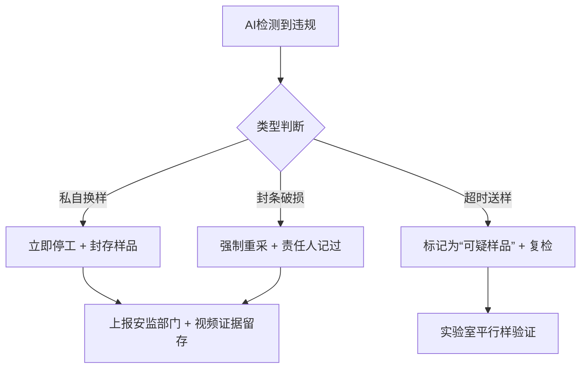

---

### **一、取样、采样、送样全流程视频录制要求**

| 环节 | 录制设备 | 录制要求 | 关键画面必须包含 |
|------|----------|----------|------------------|
| **1. 取样前准备** | 智慧安全帽 / 执法记录仪 | 开启录像前语音报备：时间、地点、人员、批次号 | 样品标签、取样工具、取样点位图 |
| **2. 取样过程** | 智慧安全帽（推荐，双手操作） | 连续不间断录制，视角覆盖取样全景+特写 | 取样口打开→工具插入→样品提取→密封→贴标全过程 |
| **3. 样品分装** | 执法记录仪（固定支架） | 清晰记录分装数量、子样品编号 | 原始样品拆分、子样品独立密封 |
| **4. 送样交接** | 执法记录仪 | 记录交接双方签字、封条完整性 | 送样单填写、封条拍照 100% 覆盖样品袋口 |
| **5. 实验室接收** | 固定摄像头+手持记录仪 | 接收人拆封前录像，核对封条编号 | 封条拆除、样品入库、系统登记 |

> **录像文件命名规范**：  
> `厂区_批次号_环节_日期时间_操作人ID.mp4`  
> 示例：`A厂_20251112-001_取样_20251112-0930_ZhangSan.mp4`

---

### **二、视频上传与存储要求**

| 项目 | 要求 |
|------|------|
| **上传方式** | 5G/Wi-Fi 自动上传（设备内置边缘网关） |
| **上传时效** | 采样完成后 **30分钟内** 完成上传 |
| **存储位置** | 企业私有云 / 地方能源监管平台 |
| **存储时长** | **不少于12个月**（可追溯1年） |
| **加密要求** | 视频文件AES-256加密，上传日志上链（可选） |

---

### **三、AI违规行为智能预警监控系统**

| 违规类型 | AI检测方式 | 预警触发条件 | 处理机制 |
|---------|------------|-------------|----------|
| **私自换样** | 人脸+手部动作识别 | 检测到非授权人员接触样品袋 | 实时弹窗+语音报警 |
| **样品袋封条缺失/破损** | 图像识别（YOLOv8+OCR） | 封条编号不连续或破损 | 自动锁样，禁止入库 |
| **取样点位错误** | 结合厂区数字孪生+定位 | GPS/北斗偏差 > 2米 | 现场语音提示+记录违规 |
| **取样量不足** | 称重传感器+视频比对 | 实际取样量 < 标准量 10% | 强制重采 |
| **送样超时时限** | 时间戳对比 | 取样→送样 > 2小时 | 系统自动标记“超时样” |

---

### **四、操作人员权限与防作弊设计**

1. **身份绑定**：智慧安全帽绑定人脸+工号，录像自动打水印（姓名+时间+GPS）
2. **双人取样制**：一人取样，一人监督录像（交叉验证）
3. **样品袋防伪**：一次性破坏性封条 + 防伪二维码
4. **视频防篡改**：录像文件加数字签名（SHA-256），上传后不可修改

---

### **五、违规行为处理流程**

---

### **六、平台功能模块（建议开发）**

| 模块 | 功能 |
|------|------|
| **视频实时监管** | 多画面巡检，异常高亮 |
| **违规行为库** | 历史案例AI学习，精准识别 |
| **电子签到+轨迹回放** | 人员+样品全流程轨迹 |
| **数据仪表盘** | 取样合规率、预警响应时长 |

---

**总结**：  
通过**智慧安全帽/执法记录仪全程录像 + AI智能分析 + 防伪封条 + 平台闭环管理**，可实现生物质燃料取样全流程**100%可追溯、0容忍作假**，有效杜绝“换样、掺假、虚报热值”等违规行为，保障发电企业与监管部门的数据真实性。

> **建议**：接入地方能源局“生物质燃料智慧监管平台”，实现跨企业数据共享与联合预警。